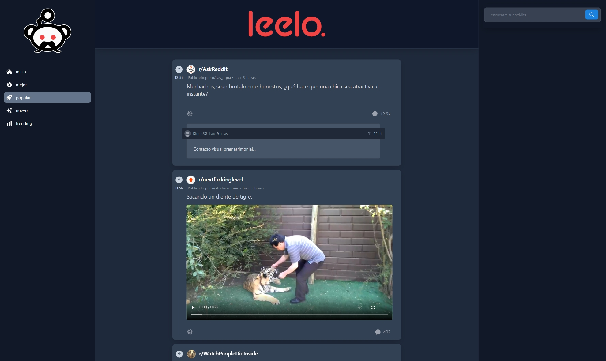
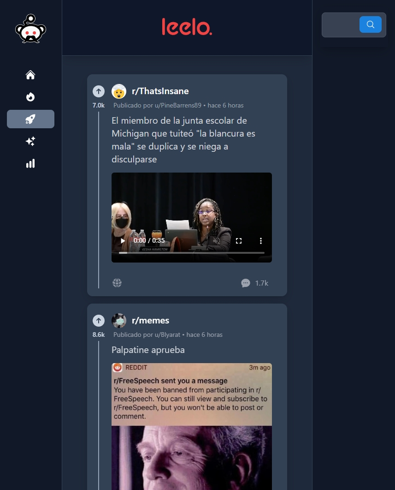
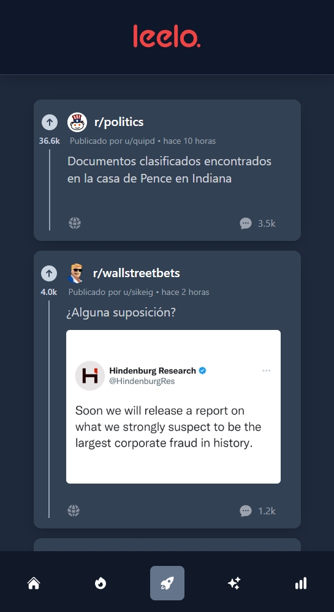
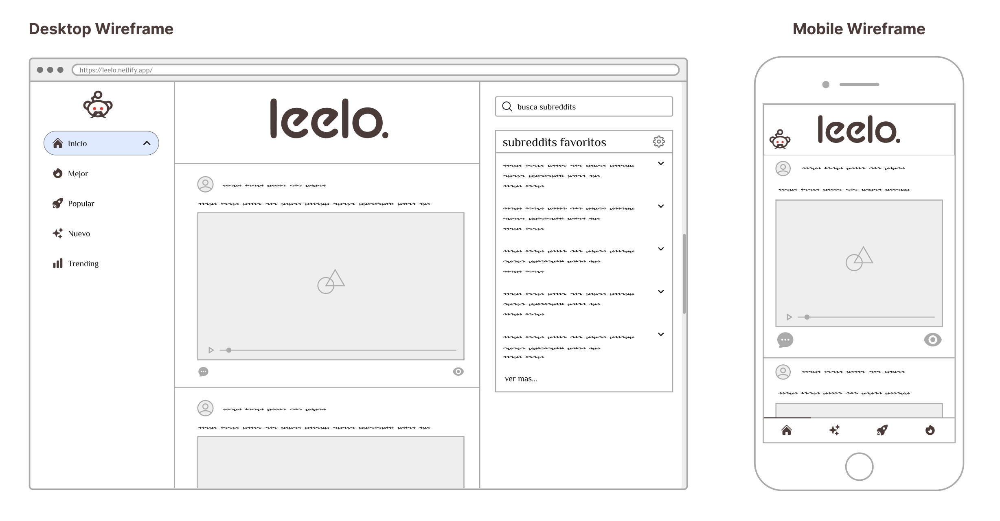

   
   

# Leelo

A web app built with React, Redux, and powered by the Reddit and Google Translate APIs. The app provides a minimalistic version of Reddit, with all content translated to Spanish. Styled with Tailwind CSS and Tailwind Heroicons, and built with Webpack, Babel, and Axios.

# Features

- Reddit content displayed, provided by the Reddit JSON Api.
- Titles, descriptions, and comments are all automatically translated to Spanish via Google Translate API.
- Sidenav to access the "best", "hot", "new", and "rising" sections of the Reddit homepage.
- Searchbar to look up specific subreddits and display their content.
- Comment section from selected post.
- Styling with Tailwind CSS and Tailwind Heroicons
- Embedding of YouTube videos from Reddit with the YouTubeEmbed component
- Loading and error state handling with custom card components

# Screenshots

## `Desktop`

  

## `Tablet`

  

## `Mobile`

  

## `Wireframe`

  

# Requirements

- Node.js `v18.12.1 or LTS`
- npm or yarn

# Installation

1. Clone the repository: `git clone https://github.com/voidoperator/leelo.git`
2. Install the dependencies: `npm install` or `yarn install`
3. Start the development server: `npm start` or `yarn start`
4. Open [http://localhost:3000](http://localhost:3000) to view the app in the browser.

# Usage

1. Use the sidenav to navigate between the different sections of the Reddit homepage.
2. Use the searchbar to look up specific subreddits.
3. Click on a subreddit from the search results to display its content.
4. Click the chat-bubble icon to display the comment section of specific posts.

# Note

- This app uses the Reddit JSON API and a working path of the Google Translate Chrome Extension, to access it's API and avoid needing to use an API Key. To use the app, you don't need to get your own API keys.

# Development

- The app is built with Webpack and polyfilled with Babel.
- Styled with Tailwind & HeroIcons.
- Prod build outputs minified CSS and mangled JS.
- ESLint extends the Airbnb-base config.
- Pre-commit forces lint script to run.
- Axios is used for all API calls.
- Relative-Time used to parse Reddit API's epoch time.
- Jest and React Testing Library are used for unit testing.

# Contributing

Pull requests are welcome. For major changes, please open an issue first to discuss what you would like to change.

# License

This project is licensed under the [MIT License](https://choosealicense.com/licenses/mit/).
